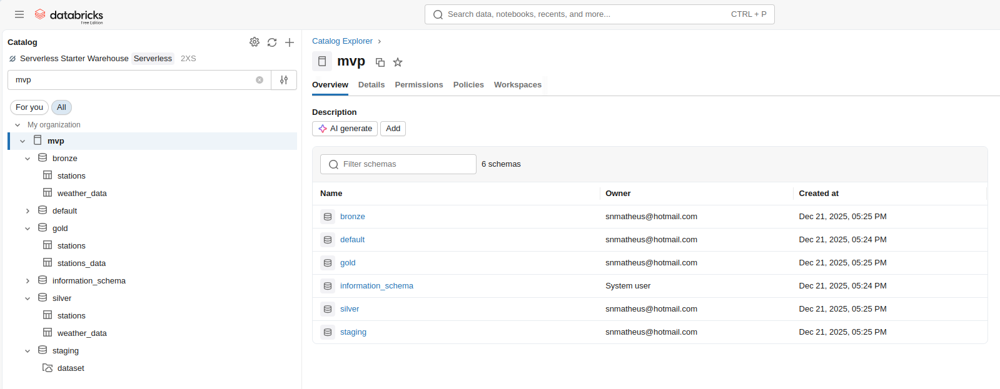
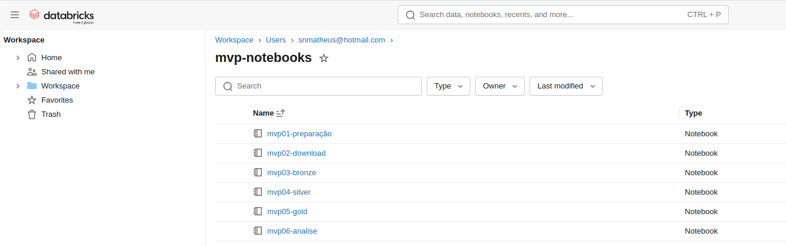
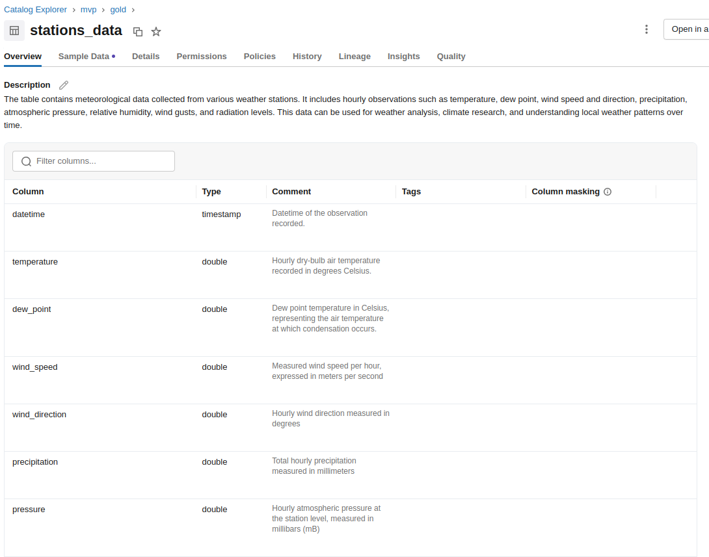

# MVP – Análise e Integração de Dados Meteorológicos no Brasil

Este repositório apresenta um **MVP de engenharia e análise de dados** focado na ingestão, tratamento, integração e análise de dados meteorológicos e cadastrais de estações no Brasil, utilizando **Databricks, Spark SQL e Delta Lake**.

O objetivo principal é demonstrar a construção de um **pipeline de dados completo**, desde dados brutos até tabelas analíticas consolidadas, além de responder perguntas exploratórias sobre a distribuição e o histórico das estações meteorológicas.

---

## 📌 Objetivos do Projeto

- Estruturar um pipeline de dados seguindo a arquitetura **Bronze / Silver / Gold**
- Avaliar a **qualidade dos dados** meteorológicos e cadastrais
- Integrar medições climáticas com informações das estações
- Analisar a distribuição espacial e temporal das estações no Brasil
- Gerar métricas e visualizações para suporte à análise climática
- Documentar tabelas e colunas diretamente no metastore

---

## 🧱 Arquitetura de Dados

O projeto segue uma arquitetura em camadas:

### 🔸 [Staging](mvp02-download.ipynb)
- Leitura inicial dos arquivos CSV
- Dados ainda sem validações ou transformações profundas

### 🔸 [Bronze](mvp03-bronze.ipynb)
- Armazenamento dos dados brutos
- Estrutura próxima à origem
- Persistência em tabelas Delta

### 🔸 [Silver](mvp04-silver.ipynb)
- Padronização de nomes de colunas
- Conversão de tipos
- Tratamento de valores ausentes
- Criação de colunas temporais
- Dados prontos para análise

### 🔸 [Gold](mvp05-gold.ipynb)
- Integração entre dados meteorológicos e estações
- Criação de indicadores derivados
- Dados consolidados para consumo analítico e visualização

---

## 🔄 Pipeline de Processamento

1. Criação do catálogo e schemas (`staging`, `bronze`, `silver`, `gold`)
2. Leitura dos CSVs meteorológicos
3. Padronização de colunas e tipos
4. Persistência em tabelas Delta
5. Integração entre estações e medições climáticas
6. Criação de métricas e classificações
7. Documentação das tabelas e colunas
8. Análises exploratórias e visualizações

---

## [📊 Análises Realizadas](mvp06-analise.ipynb)

- Distribuição de estações por **região** e **estado**
- Identificação das estações com **maior série histórica** por região
- Classificação das estações por **status operacional**
- Análises climatológicas mensais utilizando **mapas de calor**
- Agregações por status e período de registros

---

## 📈 Principais Resultados

- Cobertura nacional das estações meteorológicas
- Identificação de estados com maior e menor densidade de estações
- Séries históricas longas e consistentes (mais de 9.000 dias)
- Dados prontos para análises climatológicas de longo prazo

---

## 🛠️ Tecnologias Utilizadas

- **Databricks**
- **Apache Spark / Spark SQL**
- **Delta Lake**
- **Python (pandas, matplotlib, seaborn)**
- **SQL**

---

## 📚 Documentação

- Tabelas e colunas documentadas com `COMMENT ON`
- Inspeção de schema e metadata via `DESCRIBE EXTENDED`
- README descrevendo todo o fluxo do projeto

---

## 🚀 Trabalhos Futuros

- Inclusão de novas variáveis meteorológicas
- Ampliação do período histórico
- Automatização do pipeline de atualização
- Visualizações interativas
- Análises de tendências e anomalias climáticas
